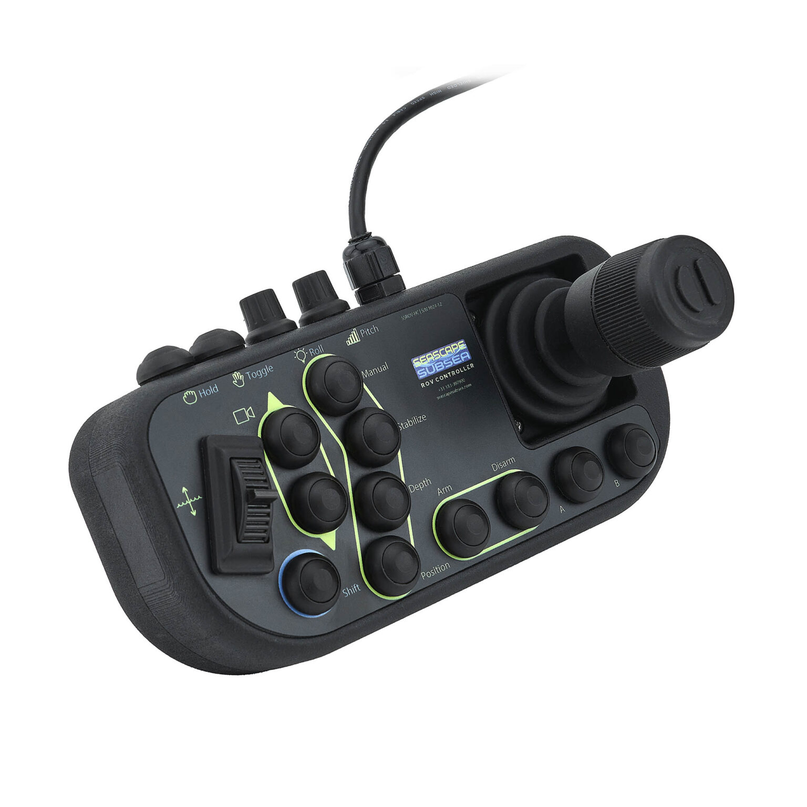

# Keelson Connector - Seascape ROV Hand Controller

[Seascape Subsea Product Page](https://www.seascapesubsea.com/product/rov-hand-controller/)



[DATASHEET.pdf](./doc/SSROV-HC-DATASHEET.pdf) | [MANUAL.pdf](./doc/SSROV-HC-MANUAL.pdf)

---

## Overview

This connector reads data from the Seascape ROV Hand Controller via USB/Serial and publishes joystick axes and button press events to the Keelson/Zenoh maritime data protocol.

**Features:**
- ✅ Reads controller data from USB serial port (`/dev/ttyACM1` or `/dev/ttyUSB0`)
- ✅ Parses joystick axes (X, Y, Rz rotation, Z throttle)
- ✅ Detects button press events (buttons 1-16)
- ✅ Publishes to Keelson/Zenoh network in real-time
- ✅ Docker container support for easy deployment
- ✅ Automatic reconnection and error handling

---

## Quick Start

### Python Direct

```bash
# Basic usage (auto-detects /dev/ttyACM1 at 115200 baud)
python3 bin/hcssrov2keelson -r rise -e rov -s controller/hc
```

### Docker

```bash
# Build and run with docker-compose
docker-compose -f docker-compose.hc-ssrov.yml up hc-ssrov-to-keelson

# Or run in detached mode
docker-compose -f docker-compose.hc-ssrov.yml up -d hc-ssrov-to-keelson
```

---

## Published Keelson Subjects

The connector publishes to the following subjects:

| Subject | Type | Description | Value Range |
|---------|------|-------------|-------------|
| `joystick_x` | TimestampedInt | X axis (left-right) | 0-1024, center ~512 |
| `joystick_y` | TimestampedInt | Y axis (forward-back) | 0-1024, center ~512 |
| `joystick_rz` | TimestampedInt | Rotation Z (twist) | 0-1024, center ~512 |
| `joystick_z` | TimestampedInt | Z axis/throttle | 0-1024, center ~512 |
| `button_pressed` | TimestampedInt | Button number (1-16) | Button ID when pressed |

**Key Expressions:**
```
rise/@v0/rov/pubsub/joystick_x/controller/hc
rise/@v0/rov/pubsub/joystick_y/controller/hc
rise/@v0/rov/pubsub/joystick_rz/controller/hc
rise/@v0/rov/pubsub/joystick_z/controller/hc
rise/@v0/rov/pubsub/button_pressed/controller/hc
```

---

## Controller Data Format

The Seascape controller sends tab-separated text data via USB serial at 115200 baud:

```
Debug X-Axis: 512	Debug Y-Axis: 522	... | X-Axis: 512	Y-Axis: 512	Rz-Axis: 512	Z-Axis: 512
	Button 16 pressed
```

**Data Characteristics:**
- Baud rate: **115200**
- Device path: `/dev/ttyACM1` (ROV-Controller V1.0.2 from seascapesubsea)
- Update rate: ~5 seconds when idle, immediate on input change
- Axes center position: approximately **512** (range 0-1024)
- Button numbering: 1-16

---

## Usage

### Command-Line Options

```
Required Arguments:
  -r, --realm REALM              Keelson realm (default: "rise")
  -e, --entity-id ENTITY_ID      Entity identifier (default: "rov")
  -s, --source-id SOURCE_ID      Source identifier (default: "controller/hc")

Serial Port Configuration:
  --port, -p PORT                Serial port device (default: "/dev/ttyACM1")
  --baud, -b BAUD                Baud rate (default: 115200)

Zenoh Configuration:
  --mode {peer,client}           Zenoh session mode (default: peer)
  --connect ENDPOINT             Zenoh router endpoint (can be used multiple times)

Logging:
  --log-level LEVEL              Log level: 10=DEBUG, 20=INFO, 30=WARN (default: 20)
```

### Examples

**Basic usage:**
```bash
python3 bin/hcssrov2keelson -r rise -e rov -s controller/hc
```

**Custom serial port:**
```bash
python3 bin/hcssrov2keelson -r rise -e rov -s controller/hc --port /dev/ttyUSB0
```

**Connect to specific Zenoh router:**
```bash
python3 bin/hcssrov2keelson -r rise -e rov -s controller/hc \
  --mode client \
  --connect tcp/192.168.1.100:7447
```

**Debug logging:**
```bash
python3 bin/hcssrov2keelson -r rise -e rov -s controller/hc --log-level 10
```

**Custom realm and entity:**
```bash
python3 bin/hcssrov2keelson -r vessel/storakrabban -e sensors -s handcontroller/primary
```

---

## Docker Deployment

### Build Image

```bash
docker build -t keelson-connector-hc-ssrov .
```

### Run with Docker Compose

```bash
# Start the connector
docker-compose -f docker-compose.hc-ssrov.yml up hc-ssrov-to-keelson

# Start in detached mode
docker-compose -f docker-compose.hc-ssrov.yml up -d hc-ssrov-to-keelson

# View logs
docker-compose -f docker-compose.hc-ssrov.yml logs -f hc-ssrov-to-keelson

# Stop the connector
docker-compose -f docker-compose.hc-ssrov.yml down
```

### Client Mode (Connect to Router)

```bash
# Use the client profile to connect to a specific Zenoh router
docker-compose -f docker-compose.hc-ssrov.yml --profile client up hc-ssrov-to-keelson-client
```

---

## Installation

### Prerequisites

- Python 3.8 or later
- USB connection to Seascape ROV Hand Controller
- Access to Zenoh router (optional for peer-to-peer mode)

### Install Dependencies

```bash
pip install -r requirements.txt
```

Key dependencies:
- `eclipse-zenoh` - Zenoh messaging library
- `keelson` - Keelson protocol implementation
- `pyserial` - Serial port communication
- `skarv` - In-memory data vault for state management

---

## Development

### Project Structure

```
keelson-connector-hc-ssrov/
├── bin/
│   ├── hcssrov2keelson       # Main connector script
│   ├── terminal_inputs.py    # Argument parsing
│   └── main                  # Legacy script (deprecated)
├── examples/                 # Python examples for reading controller
│   ├── serial_pyserial_reader.py
│   ├── simple_udp_reader.py
│   └── README.md
├── doc/                      # Documentation and datasheets
├── docker-compose.hc-ssrov.yml
├── Dockerfile
├── requirements.txt
└── README.md
```

### Testing Without Hardware

See the [examples/](examples/) directory for standalone Python scripts to test controller reading without Zenoh:

```bash
# List available serial ports
python3 examples/serial_pyserial_reader.py --list-ports

# Read controller data directly
python3 examples/serial_pyserial_reader.py --port /dev/ttyACM1
```

---

## Troubleshooting

### Controller Not Detected

**Check if device is connected:**
```bash
ls -l /dev/ttyACM* /dev/ttyUSB*
```

**List all serial ports:**
```bash
python3 examples/serial_pyserial_reader.py --list-ports
```

### Permission Denied

On Linux, add your user to the `dialout` group:

```bash
sudo usermod -a -G dialout $USER
# Log out and back in, or use:
newgrp dialout
```

### Wrong Serial Port

The controller usually appears as:
- `/dev/ttyACM1` - "ROV-Controller V1.0.2" (most common)
- `/dev/ttyUSB0` - On some systems

Specify the correct port with `--port`:
```bash
python3 bin/hcssrov2keelson --port /dev/ttyUSB0 ...
```

### No Data Received

1. **Check baud rate** - Should be 115200
2. **Verify controller is powered on**
3. **Try moving joysticks** - Data is sent on change
4. **Enable debug logging** - `--log-level 10`

---

## References

- **Keelson Protocol**: [https://rise-maritime.github.io/keelson/](https://rise-maritime.github.io/keelson/)
- **Zenoh**: [https://zenoh.io/](https://zenoh.io/)
- **Skarv**: [https://freol35241.github.io/skarv/](https://freol35241.github.io/skarv/)
- **PySerial**: [https://pythonhosted.org/pyserial/](https://pythonhosted.org/pyserial/)

---

## License

[Include your license information here]

---

## Contributing

Contributions are welcome! This connector follows the design patterns established in:
- [keelson-connector-nmea](https://github.com/RISE-Maritime/keelson-connector-nmea)
- [keelson-connector-ais](https://github.com/RISE-Maritime/keelson-connector-ais)

---

## Support

For issues and questions:
- Open an issue on GitHub
- Refer to the [examples/](examples/) directory for standalone testing scripts
- Check the Keelson documentation for protocol details
